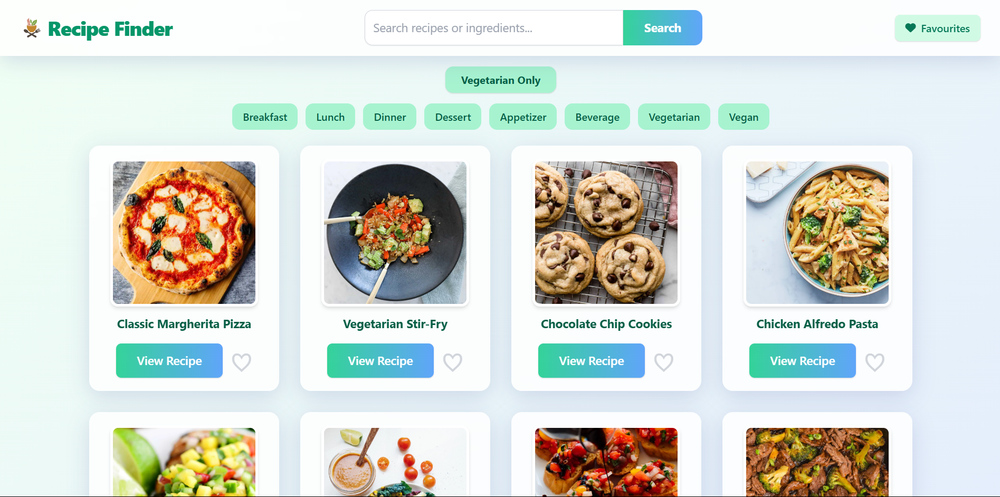

# 🥗 Beautiful Recipe Finder

A modern, responsive recipe discovery app built with HTML, Tailwind CSS, and JavaScript that lets food lovers instantly search, discover, and explore random or specific recipes from around the world. Powered by the Random Recipes API from RapidAPI, it features filtering by category or vegetarian options, the ability to save favourites, and presents everything in a beautiful glassmorphism UI with smooth animations, seamless transitions, and an intuitive user experience.

> 🌐 **Live Demo:** _Add your deployment link here_



[](LICENSE)
[](https://developer.mozilla.org/en-US/docs/Web/HTML)
[](https://developer.mozilla.org/en-US/docs/Web/CSS)
[](https://developer.mozilla.org/en-US/docs/Web/JavaScript)
[](https://tailwindcss.com/)

[](https://fontawesome.com/)
[](https://git-scm.com/)
[](https://github.com/)
[](https://github.com/)

---

## ✨ Features

- **🍲 Random Recipes:** Instantly discover a variety of random recipes with images, ingredients, and instructions
- **🔎 Powerful Recipe Search**: Find recipes by name or ingredient
- **🍽️ Category Browsing**: Explore recipes by meal type (breakfast, lunch, dinner, dessert, etc.)
- **🥦 Vegetarian Toggle**: Instantly filter for vegetarian recipes
- **❤️ Favourites**: Like and save your favourite recipes for quick access
- **📱 Fully Responsive Design**: Looks great on desktop, tablet, and mobile
- **🎨 Modern UI**: Elegant glassmorphism, gradients, and smooth animations
- **⚡ Fast & Lightweight**: No frameworks or build tools required—just open and use!
- **🖼️ Recipe Details**: View ingredients, instructions, and images in a beautiful modal
- **🔄 Load More**: Seamlessly browse more recipes with pagination
- **🕘 Loading & Error Handling**: Animated loading states and friendly error messages

## 🎮 Usage Guide

### Basic Controls

- **Load Recipes:** Recipes are loaded automatically on page load
- **View Details**: Click "View Recipe" to see full details, ingredients, and instructions in a modal
- **Search**: Enter a recipe or ingredient and click Search or press Enter
- **Browse by Category**: Click a category button to filter recipes
- **Vegetarian Only**: Toggle the "Vegetarian Only" button to filter results
- **Like/Unlike:** Click the heart icon to add/remove a recipe from your favourites
- **Load More:** Click "Load More" to fetch more random recipes
- **View Favourites:** Click the Favourites button in the navbar to see your liked recipes

### Error Handling

- Friendly error messages appear if recipes cannot be loaded or found

## 🔧 Tech Stack

### **Technologies Used**
- **HTML5**: Semantic markup
- **Tailwind CSS**: Utility-first CSS framework via CDN
- **JavaScript ES6+**: Async/await, DOM manipulation, fetch API
- **Font Awesome**: Icon library via CDN
- **DummyJSON Recipes API**: Recipe data and images
- **Git** – Version control
- **GitHub** – Code hosting and collaboration

## 🛠️ Getting Started

1. **Clone the repository:**
   ```bash
   git clone https://github.com/pvm-harshavardhan/recipe-finder.git
   ```
2. **Change to the project directory:**
   ```bash
   cd recipe-finder
   ```
3. **Open the app:**
   - Open `index.html` in your web browser.

4. **Start searching for recipes!** 🥗

_No build step or server required!_

---

**Optional: Use a Different Recipe API**

- You can easily switch to another recipe API (such as [Spoonacular](https://spoonacular.com/food-api), [TheMealDB](https://www.themealdb.com/api.php), or a [RapidAPI](https://rapidapi.com/), recipe endpoint).
- To do this, update the `BASE_URL` at the top of `main.js` and adjust the fetch logic and data mapping as needed to match the new API's structure and authentication requirements.
- Some APIs may require an API key—refer to their documentation

## 📁 Project Structure

```
recipe-finder/
├── index.html       # Main HTML file with Tailwind CDN
├── main.js          # JavaScript logic for recipes, UI, and favourites
├── favLogo.png      # App favicon
├── logo.png         # App logo
├── project_screenshot.png # App screenshot for README
```

## 🔑 API Configuration

The app uses the **DummyJSON Recipes API** for recipe data:

- **Base URL**: `https://dummyjson.com/recipes`
- **No API Key required**
- **Free Tier**: Available for usage

## 📱 Browser Compatibility

- ✅ Chrome (recommended)
- ✅ Firefox
- ✅ Safari
- ✅ Edge
- ⚠️ Internet Explorer (limited support)

## 🐛 Troubleshooting

### **Recipes Not Loading?**
1. Check your internet connection.
2. Ensure the API URL is correct and accessible.
3. Check the browser console for errors.
4. Verify file paths in the code.

### **Styling Issues?**
1. Make sure Tailwind CSS CDN is accessible
2. Clear browser cache

### **Mobile Issues?**
1. The app is fully responsive
2. Touch controls work on mobile devices
3. Some mobile browsers may restrict auto-focus or popups

---

## 🖼️ Customization & Screenshots

- Replace `favLogo.png` and `logo.png` with your own branding if desired
- Update colors and styles in Tailwind config or HTML classes
- **API Flexibility:**  
  - The app is designed to be easily adaptable to different recipe APIs.
  - For detailed steps on changing the API, see the “Getting Started” section.


---

## 🌐 Deployment

Deploy your Recipe Finder easily using **GitHub Pages**, **Netlify**, or **Vercel** for free.

---

## 🤝 Contributing

Contributions are welcome!  
Feel free to open issues or submit pull requests to improve the app.

---

## 📄 License

This project is licensed under the **MIT License** - see the [LICENSE](LICENSE) file for details.

## 📞 Contact

Your Name - [@pvm_harsha](https://x.com/pvm_harsha)  
Project Link: [Recipe Finder Web Project](https://github.com/pvm-harshavardhan/recipe-finder)

---

**Made with ❤️ by P VM Harsha Vardhan**

**Enjoy cooking! 🍳🥗🍰**